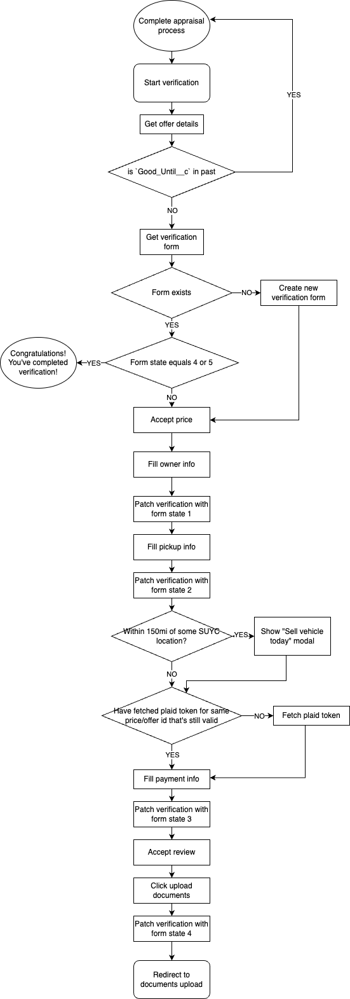

# Verification workflow of appraisal app

Verification process is a second workflow of appraisal application just after user gets a price for a vehicle.

Verification process consists of several steps:

- Owner verification
  - Primary owner information
  - Secondary owner information
  - Exact mileage on vehicle odometer
- Pickup information
  - Pickup address
  - Pickup contact
- Payment information
  - Payments on vehicle info
  - Deposit information
- Documents upload (this is step that's not built in appraisal application but is integral part of verification process)

## Before beginning

Before starting verification process we must fetch an appraisal offer to check if offer is still valid (user is not allowed to proceed if offer is expired).

After that, we get current verification form, if one doesn't exist we create a new one.

If form exists and form_state field equals to 4 or 5 that means that verification process is completed and user should proceed to documents upload. (show modal with documents upload button)

When everything is fetched and data is validated, we determine the initial step of verification process based on data we have.

## Owner verification

Owner verification is first step of verification process. User is asked for primary and secondary owner as well as vehicle mileage. During that process we ask user for a address for both owners.

We use Google Maps API to get autocomplete and make it easier for user to fill address fields.

After this step we update verification with all data we have and proceed to next step.

Form state should be set to 1 after this step.

## Pickup information

Pickup information is second step of verification process. User is asked for pickup address and contact information.

We use Google Maps API to get autocomplete and make it easier for user to fill address field.

We ask user if address same as a primary owner and contact same as primary owner contact but fields for that purpose in verification model must be filled manually by developer with data from previous step even if user selects that option.

Before we jump to the next step, we check if pickup location is within radius of 150mi from some of our SUYC locations. If that is case, we show user a dialog that pickup location is within radius, and they can bring vehicle there.

After this step we update verification with all data we have and proceed to next step.

Form state should be set to 2 after this step.

## Payment information

Payment information is third step of verification process. User is asked for payments on vehicle and deposit information.

Before proceeding to this step we must make sure that we have Plaid token required to make connection with 3rd party service.

If you have non-expired Plaid token fetched for a same price id you should use that token, if not, you should get a new one.

User can edit payments on vehicle information but deposit information is not editable once it's set.

After this step we update verification with all data we have and proceed to next step.

Form state should be set to 3 after this step.

## End

When all steps are completed and user clicks button for "Documents upload" we should patch verification to state 4 and after that do not allow user to make further edits to verification form.

## Verification process diagram

